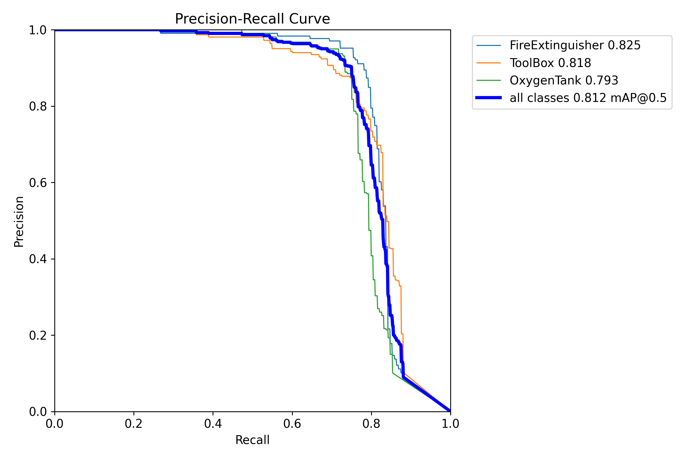
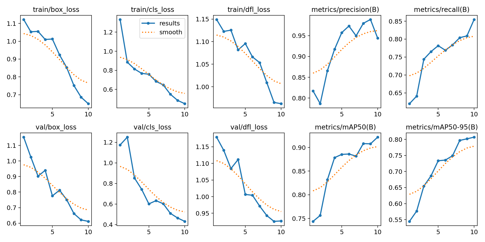
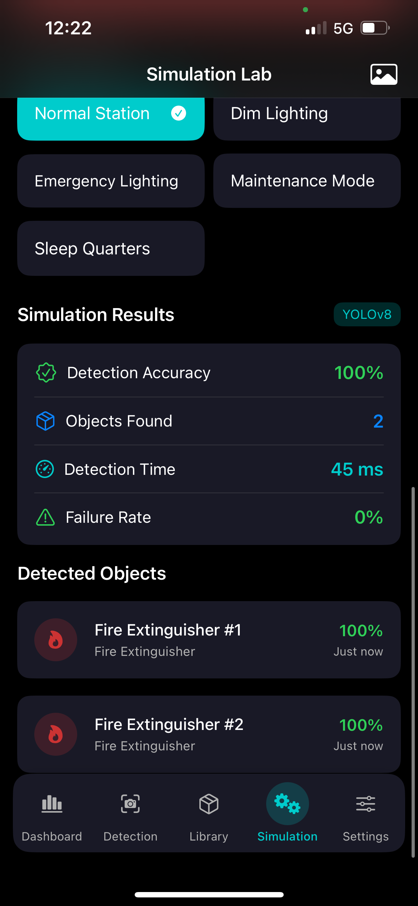

# SafeSpace

## Overview
SafeSpace is an iOS application that uses advanced machine learning to detect objects in space station environments. Leveraging the YOLOv8 object detection model, the app helps astronauts and space personnel identify and categorize objects in various lighting conditions and environments that might be encountered aboard a space station.

The current implementation is trained on the Falcon synthetic dataset and can detect three critical safety-related object classes:
- Fire extinguishers
- Toolboxes
- Oxygen tanks

## Features

### Real-time Object Detection
- Camera-based detection with advanced YOLOv8 model
- Real-time processing and feedback
- Detection metrics including accuracy and processing time

### Simulation Laboratory
- Test object detection in simulated space environments
- Adjustable lighting and occlusion conditions
- Multiple environment presets (Normal Station, Dim Lighting, Emergency Lighting, etc.)
- Interactive zoom functionality for detailed analysis

### Detailed Analysis
- Comprehensive detection results with confidence scores
- Performance metrics for detection accuracy
- List of detected objects with classification
- Classification of fire extinguishers, toolboxes, and oxygen tanks with confidence scores

## Technical Details

### Machine Learning
- Implements YOLOv8 (You Only Look Once) object detection model
- Trained on the Falcon synthetic dataset of space station environments
- Optimized for iOS using Core ML framework
- Fast inference time (typically under 50ms)
- Specialized in detecting safety equipment in space habitats

### Model Performance
The optimized YOLOv8m model was trained on the HackByte_DataSet (Falcon synthetic dataset) specifically for space station environments. Below are the performance metrics:

#### Confusion Matrix
The confusion matrix shows the model's classification accuracy across the three object classes:

<div align="center">
  
</div>

#### Precision-Recall Curve
The PR curve demonstrates the balance between precision and recall across different confidence thresholds:

<div align="center">
  
</div>

#### Training Results
The results graph shows the model's performance metrics during training, including mAP (mean Average Precision), precision, and recall:

<div align="center">
  
</div>

Key performance indicators:
- mAP@50: 0.812(all classes)
- Precision: 1.00 at 0.952(all classes)
- Recall: 0.85 at 0.000(all classes)
- F1-Score: 0.810 at 0.344(all classes)

### iOS Technologies Used
- SwiftUI for modern, responsive UI
- AVFoundation for camera handling
- Core ML for on-device machine learning
- Combine for reactive state management

## Requirements
- iOS 16.0 or later
- iPhone or iPad with camera
- Xcode 14+ (for development)

## Installation
1. Clone the repository
   ```
   git clone https://github.com/yourusername/SafeSpace.git
   ```
2. Install dependencies.
   
3. Open the project in Xcode
   ```
   cd SafeSpace
   open SafeSpace.xcodeproj
   ```
4. Build and run on a physical device for full functionality

## Usage

### Detection Mode
1. Launch the app and navigate to the Detection tab
2. Grant camera permissions when prompted
3. Point the camera at objects to detect
4. Tap the capture button to analyze the current frame
5. Review detected objects and their confidence scores

### Simulation Lab
1. Navigate to the Simulation tab
2. Upload an image using the photo picker or use a previously captured image
3. Select an environment preset or adjust lighting/occlusion levels manually
4. Press "Start Simulation" to run the detection model
5. Pinch to zoom in/out on the results for detailed inspection
6. Double-tap to reset zoom level

## License
[MIT]

## Acknowledgments
- YOLOv8 developed by Ultralytics
- HackByte_DataSet (Falcon synthetic dataset) for space station environments

## Screenshots

<div align="center">
  <p float="left">
    
    
  </p>
  <p>Camera Detection Interface (left) and Simulation Lab (right)</p>

  <p float="left">
    
    
  </p>
  <p>Detection Results (left) and Object Detection Flow (right)</p>

  <p float="left">
    
    
  </p>
  <p>Simulation Workflow (left) and Additional View (right)</p>
</div> 
